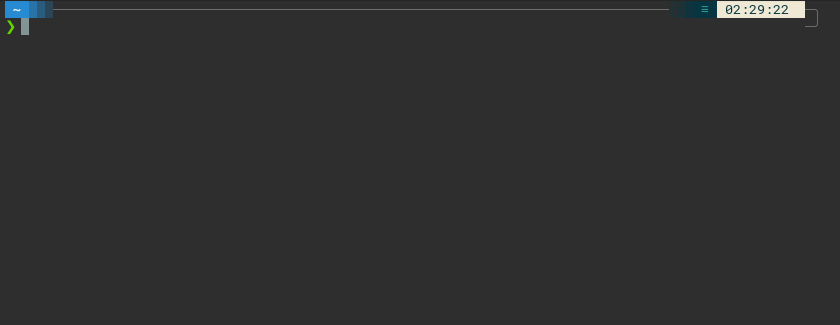

[](https://badge.fury.io/js/madman)
[](https://madman-cli.netlify.app)


[](https://badge.fury.io/js/madman)
[](https://badge.fury.io/js/madman)
[](https://badge.fury.io/js/madman)
[](https://github.com/Raiper34/madman)


# Madman
**Madman** - MD manual - is the command-line tool that turns any `*.md` files into command-line manual pages.
It can turn any repository with `*.md` files or even a local folder with `*.md` files into manual pages.

I have missed an easy-to-use tool for showing my notes in the terminal.
The main idea behind the tool is to have some note repositories on GitHub, which are separated `*.md` files and are modified by GitHub's WYSIWYG editor, and these notes should be easily displayed using a command line interface.

The tool is developed generally and surely can be used in other ways too, but the general idea is above.  


### Content
- [🚀 Installation](#-installation)
- [💻 Usage](#-usage)
- [📚 Documentation and demos](#-documentation-and-demos)
- [📖 License](#-license)

## 🚀 Installation

Install **madman** tool
```
npm install madman --global
```

## 💻 Usage
## Add
To add the first documentation, run `madman add` command like
```
madman add --name madman-doc --remote true --repo git@github.com:Raiper34/madman.git --folder docs
``` 
Then command creates example documentation from `docs` folder of `git@github.com:Raiper34/madman.git` repository.

## Show
To show documentation, run `madman <DOC_NAME>` command in above example `madman madman-doc`
```
madman example
```
now it is possible to navigate in documentation using `arrow` keys and show a specific page using the `enter` key.

## 📚 Documentation and demos
[Online documentation](https://madman-cli.netlify.app/)

# ⚖️ License
[MIT](https://choosealicense.com/licenses/mit/)
